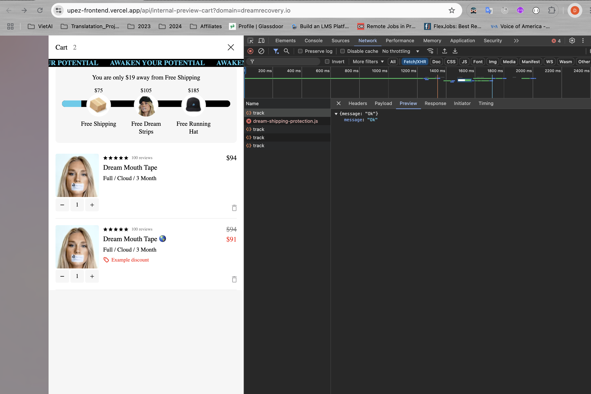
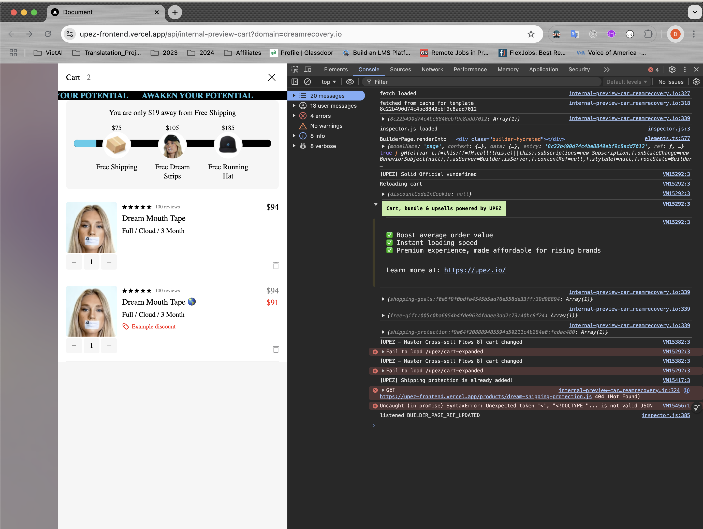
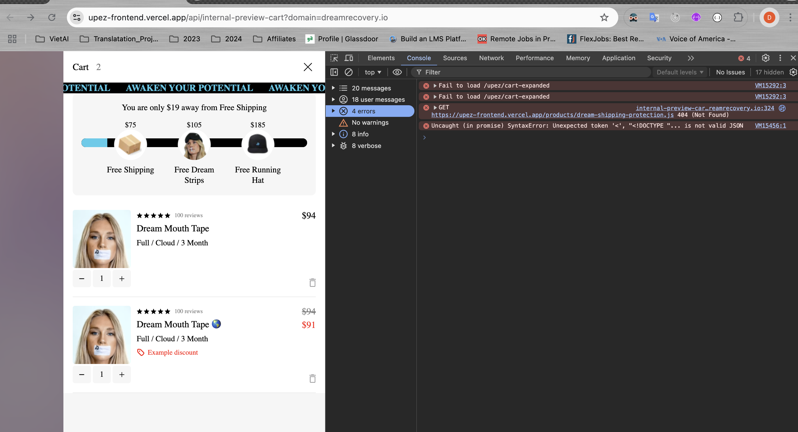
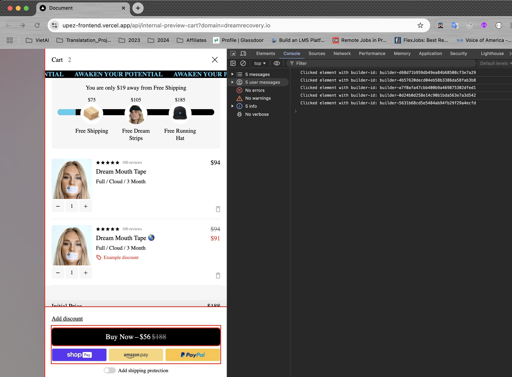

# Readme

- Did I use the wrong link or something?  
  [https://upez-frontend.vercel.app/api/internal-preview-cart?domain=dreamrecovery.io]
  Because I don't see the request matching the description in the task.

- This is a screenshot of my Network Tab after refreshing, filtered as described in the task:

  

- This is the Console Tab after refreshing. Is there anything unusual or any errors compared to normal?

  

  And here is the second screenshot:

  

## Final

I followed the way I understood it. Please help me check.

Copy and paste all the code in `script.js` into the Chrome console. Below is the result screenshot from running it on my laptop.

