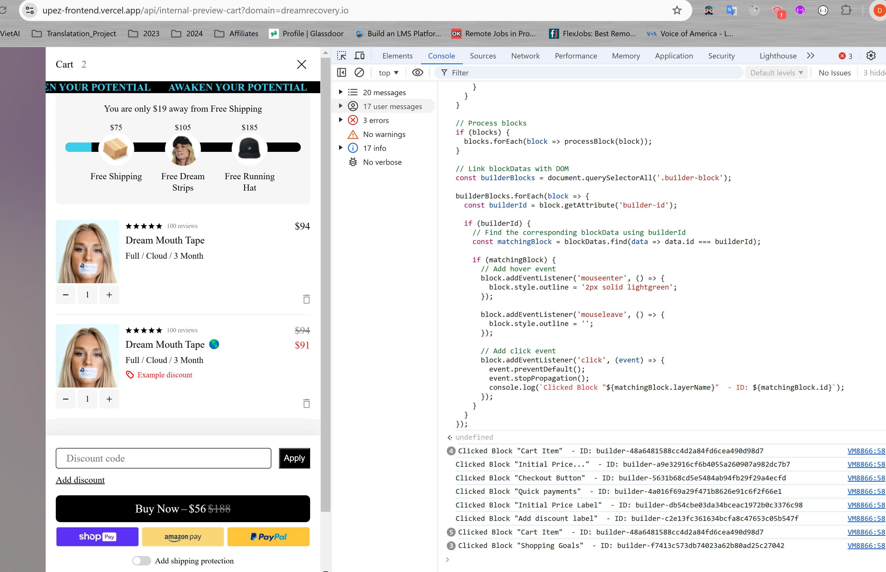

# Readme

- Did I use the wrong link or something?  
  Because I don't see the request matching the description in the task.

- This is a screenshot of my Network Tab after refreshing, filtered as described in the task:

  

- This is the Console Tab after refreshing. Is there anything unusual or any errors compared to normal?

  

  And here is the second screenshot:

  

- However, I proceeded with the task based on the logs from the Console since I was able to retrieve the data. Here is the result:

  
